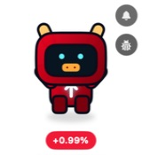
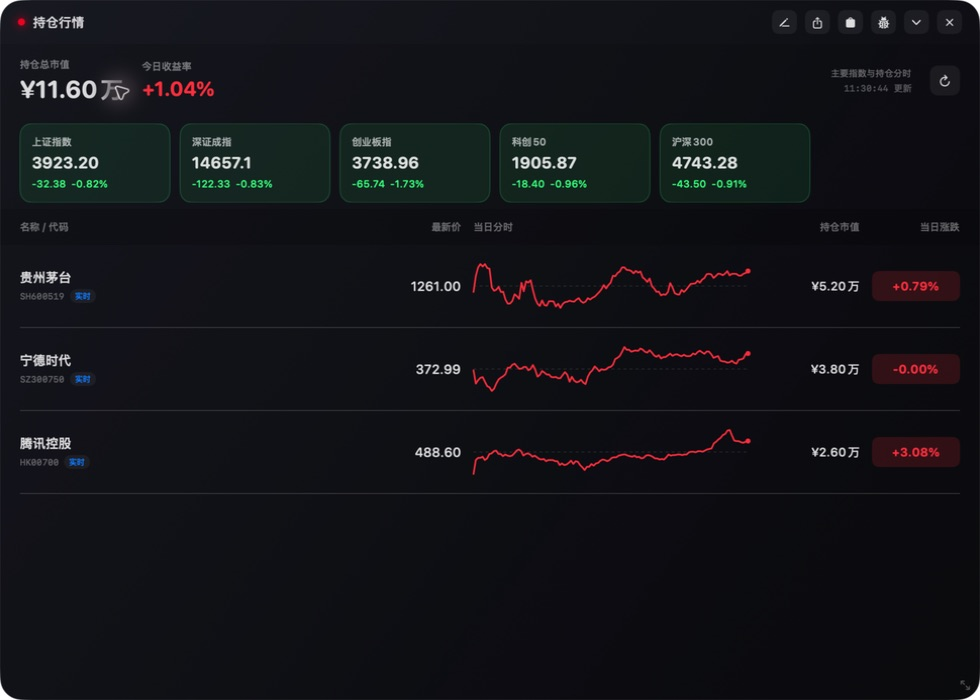
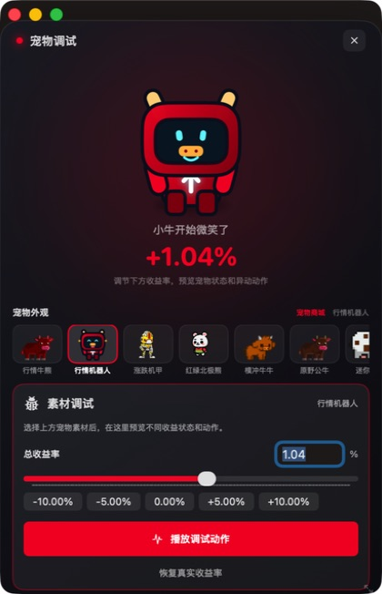
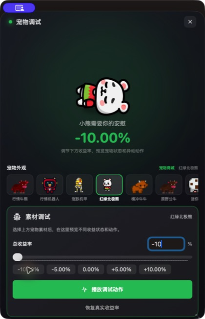
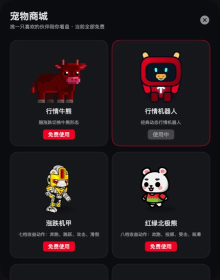
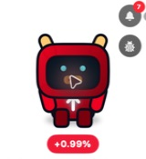
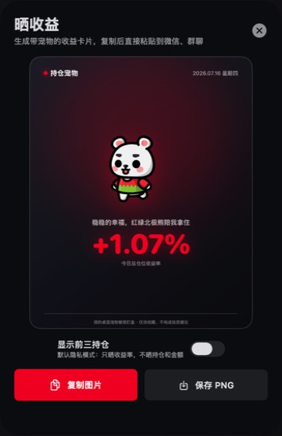

# 持仓宠物：把股票涨跌做成一只有情绪的 macOS 桌宠

> 用 SwiftUI 做一只会根据持仓收益率切换牛熊情绪、动作和体型的桌面宠物，并把行情、持仓、资讯、素材调试与收益分享收进一个轻量 macOS 应用。

## 为什么做持仓宠物

看盘软件通常把注意力集中在数字、红绿和曲线上。信息足够准确，却也容易让人持续盯着窗口。

持仓宠物换了一个角度：让应用平时只是一只住在桌面的迷你宠物。收益上涨时，它会开心、跳跃或进入攻击动作；收益下跌时，它会紧张、受击、滑倒或需要安慰。只有需要查看细节时，才打开完整持仓面板。

## 核心体验

| 功能 | 设计目标 |
|------|----------|
| 桌面宠物 | 平时保持轻量、置顶，不遮挡正常工作 |
| 收益情绪 | 将收益率映射成牛市、熊市和多档动作 |
| 持仓面板 | 集中展示总市值、当日收益、指数和持仓 |
| 行情资讯 | 在桌宠附近快速查看核心持仓的相关新闻 |
| 宠物商城 | 在同一套状态系统中切换机器人、机甲、牛熊与多款动物 |
| 调试窗口 | 独立预览不同收益率、皮肤与动画，不影响桌面宠物 |
| 收益分享 | 生成只晒收益或包含持仓信息的宠物分享卡 |

## 从一只宠物展开成完整持仓面板

单击宠物可以打开主面板。这里同时展示总持仓市值、今日收益率、主要指数和持仓明细；再次收起后，桌面只保留宠物。

这套交互把“看一眼”和“认真查看”拆成两种状态：

- **桌面状态**：只保留情绪、收益率与必要入口。
- **面板状态**：提供完整行情、持仓编辑、分享、商城与调试能力。

## 收益率驱动的动作系统

宠物动作不是简单的正负切换。不同皮肤可以定义自己的空闲、上涨、下跌、奔跑、跳跃、攻击、受击和崩溃帧序列，再根据收益率区间选择动画。

调试页是一个真正独立的 macOS 窗口。打开它时，桌面宠物仍然保持显示；修改调试收益率也不会把调试窗口错误缩成桌宠尺寸。

## 一套状态，多款宠物

宠物商城目前包含行情牛熊、行情机器人、涨跌机甲、红绿北极熊、横冲牛牛、原野公牛、迷你奶牛、布布熊、搞笑白熊和围巾棕熊。

每款素材都复用统一的市场状态接口，但可以有不同帧数、动作强度和角色文案。这让新增宠物不需要重新实现整套行情逻辑。

## 资讯和收益分享

桌宠旁边可以快速展开核心持仓资讯，避免为了确认一条消息打开完整行情软件。

分享页会把宠物、日期、收益率和文案组合成卡片。默认隐私模式只展示收益率，不公开持仓金额和名称。

## 技术实现

| 模块 | 实现 |
|------|------|
| UI | SwiftUI |
| 原生窗口 | AppKit + SwiftUI 多窗口 |
| 动画 | PNG 帧动画 + 收益率分档状态机 |
| 行情 | 公开行情接口定时刷新 |
| 通知 | UserNotifications + AVSpeechSynthesizer |
| 数据 | UserDefaults 本地保存 |
| 构建 | swiftc、codesign、hdiutil 生成 DMG |

应用使用独立的主桌宠窗口与调试窗口。桌宠窗口保持透明、无边框和浮层展示；调试窗口拥有自己的最小尺寸与窗口生命周期。窗口缩放逻辑只会匹配主窗口，避免当前焦点窗口变化后误操作调试页。

## AI 协作开发

这个项目也用来验证一种更直接的 AI 协作方式：从素材调研、帧动画整理、交互修复、真实界面回归，到 DMG 打包和 GitHub Release 发布，都在同一条开发链路中完成。

我更关注的不是“AI 写了多少代码”，而是它能否持续读取真实界面、定位窗口状态问题、完成验证，再把结果交付成可安装的软件。

## 下载与源码

- [下载持仓宠物 v0.3.3（Apple Silicon）](https://github.com/andy304yang/Pet-stock/releases/tag/v0.3.3)
- [查看 GitHub 源码](https://github.com/andy304yang/Pet-stock)

当前版本要求 macOS 15 或更高版本，仅提供 Apple Silicon 构建。项目用于行情展示与桌面陪伴，不构成任何投资建议。
